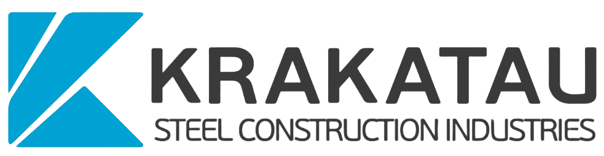

<br />
<div align="center">
  <a href="#">
    
  </a>

  <h3 align="center">PT Krakatau Baja Konstruksi - Corporate Website</h3>

  <p align="center">
    The Official Corporate Information System of PT Krakatau Baja Konstruksi
    <br />
  </p>
</div>

<!-- Badges -->
<div align="center">
  
  
  
  
  
</div>

---

<!-- TABLE OF CONTENTS -->
<details>
  <summary>Table of Contents</summary>
  <ol>
    <li><a href="#about-the-project">About The Project</a></li>
    <li><a href="#key-features">Key Features</a></li>
    <li><a href="#built-with">Built With</a></li>
    <li><a href="#getting-started">Getting Started</a></li>
    <li><a href="#usage">Usage</a></li>
    <li><a href="#whistle-blowing-system-wbs">Whistle Blowing System (WBS)</a></li>
  </ol>
</details>

## About The Project

This project is the official web-based information system and corporate profile for **PT Krakatau Baja Konstruksi (KBK)**, a subholding company of PT Krakatau Steel (Persero) Tbk. The website is designed to present corporate information comprehensively, modernly, and multilingually, catering to both domestic and international clients.

The system serves not only as a public interface but is also equipped with a robust, custom-built *Content Management System (CMS)* or Admin Panel. This panel independently manages corporate data such as Hero Banners, Products, News, History, Board of Directors/Commissioners structures, and WBS Reports.

## Key Features

- 🌍 **Multilingual System (Bilingual)**: Content is available in two languages: Indonesian (ID) and English (EN). This feature is dynamic down to the *Database* level (news, product descriptions, company history, etc., are designed with direct database translations).
- 🛠️ **Custom Content Management System (Admin Panel)**:
  - Steel Products & Categories Management
  - Project Portfolio Management
  - Corporate News & Articles Publication
  - *About Us* Page Management (History, Board of Directors, Organizational Chart)
  - Hero Banner & Corporate Video Management
- 📞 **Contacts & Sales Data**: A dynamic directory of the company's Sales and Marketing team.
- ⚖️ **Whistle Blowing System (WBS)**: A confidential reporting form for the public and employees regarding violations of *Good Corporate Governance*, securely integrated into the Admin Panel.
- 📱 **Fully Responsive Design**: An adaptive website layout across various device sizes, seamlessly scaling from Mobile and Tablets to Widescreen Desktops.

## Built With

- **Backend Framework**: [Laravel 12.x](https://laravel.com)
- **Database**: MySQL
- **Frontend Library/CSS**: [Tailwind CSS](https://tailwindcss.com/) & [Alpine.js](https://alpinejs.dev/)
- **Asset Bundling**: [Vite](https://vitejs.dev/)
- **Rich Text Editor**: Quill.js (For News & Specification Editors in the Admin Panel)
- **Fonts**: [Google Fonts](https://fonts.google.com/) (Red Rose & Figtree)

---

## Getting Started

To get a local copy up and running on your machine, follow these simple steps:

### Prerequisites

Ensure your machine meets the following requirements:

- PHP ^8.2
- Composer
- Node.js (latest LTS recommended) & NPM
- MySQL or MariaDB

### Installation Steps

1. **Clone the repository**

   ```bash
   git clone https://github.com/Ardikaas/website-krakatau-baja-kontruksi.git
   cd website-krakatau-baja-kontruksi
   ```

2. **Install PHP dependencies via Composer**

   ```bash
   composer install
   ```

3. **Install Node.js dependencies via NPM**

   ```bash
   npm install
   ```

4. **Set up the `.env` configuration**

   ```bash
   cp .env.example .env
   ```

   *Open the `.env` file and configure your local database connection (DB_DATABASE, DB_USERNAME, DB_PASSWORD).*

5. **Generate the Application Key**

   ```bash
   php artisan key:generate
   ```

6. **Migrate and Seed the Database**
   *This application includes custom Seeders that automatically download high-quality dummy images from Unsplash to your local `storage` folder, providing an authentic and realistic UI preview out-of-the-box.*

   ```bash
   php artisan migrate:fresh --seed
   ```

7. **Create the Storage Link**

   ```bash
   php artisan storage:link
   ```

8. **Compile Frontend Assets (Tailwind/CSS/JS)**

   ```bash
   npm run build
   # or for development with hot-reload: npm run dev
   ```

9. **Run the Application**

   ```bash
   php artisan serve
   ```

   *The Public Front-End is accessible at: `http://localhost:8000`*
   *The Admin Dashboard is accessible at: `http://localhost:8000/admin`*

---

## Usage

### 1. Admin Panel

- Access the `/admin` route.

- Login using the Admin credentials (Can be found in the `AdminSeeder` or your local database).
- Use the *Sidebar Menu* to manage all components ranging from News, Products, Projects, Landing Page settings, to WBS.
- **Important**: Every content input (such as Products/News/History) will require inputs in both **Bahasa Indonesia** and **English** simultaneously to fully support the Bilingual Front-End system.

### 2. Front-End (Public Website)

- **Language Switcher Toggle**: Visitors can switch between languages using the globe icon dropdown located at the top right corner of the navigation menu. Website translations will adjust according to their preference immediately.

- **WBS Page**: Located in the Footer menu ("Lapor/WBS"). The public and employees can report corporate governance anomalies entirely *Anonymously*.

---

## Whistle Blowing System (WBS)

This project prioritizes compliance with State-Owned Enterprises (BUMN) Good Corporate Governance (GCG) standards. The WBS module allows whistleblowers to log:

- Incident Types (Corruption, Conflict of Interest, Ethical Violations)
- Evidence Document Uploads (Safely stored and protected within the local server storage)
- Identity declarations (Open identity or strictly Anonymous)
These reports can only be reviewed by authorized high-level Administrators within the secure Dashboard.

---

<p align="center">
  <i>&copy; 2026 PT Krakatau Baja Konstruksi. All rights reserved.</i>
</p>
